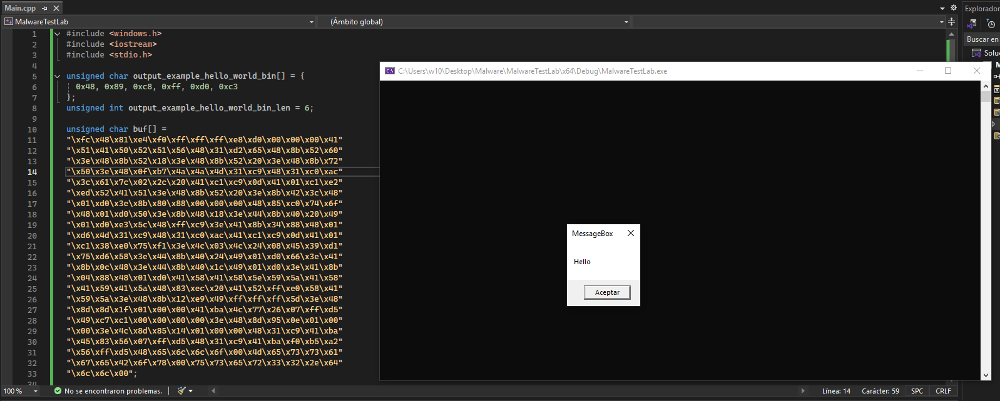

# ShellcodeLab
This repository is an example of how to compile and execute assembly code. We simply put the code we want to execute in an `.asm` file. With this method, we could pass some binary static analyses.

## Usage
In order to compile the code and convert it to hexadecimal (to use it as shellcode), we will have to do the following:

```bash
./compiler-shellcode <FILE>.asm
```

## Example of usage
```bash
$ ./compiler-shellcode example_hello_world.asm
[*] Tool to generate Windows shellcode.
[*] Generating the shellcode...
unsigned char output_example_hello_world_bin[] = {
  0x48, 0x89, 0xc8, 0xff, 0xd0, 0xc3
};
unsigned int output_example_hello_world_bin_len = 6;
```

## Execution of one of the examples
The example below simply creates space for the two shellcodes, the first of which we simply use as a bridge to call the second. It is not overly complex, as the idea is not to provide practical, useful examples but rather to demonstrate the potential of this repository. For the example, I disabled Windows Defender, as the second shellcode (theoretically the most important one) is quite closely monitored. It is a simple `MessageBox` from the Windows API.



> [!WARNING]
> This repository is intended for educational purposes only. Do not use these functions on systems without proper authorization.